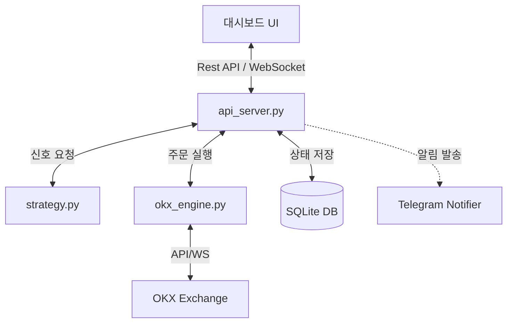

# 🌌 ANTIGRAVITY v2.2: Premium OKX AI Trading Terminal


**ANTIGRAVITY v2.2**는 단순한 매매 봇을 넘어, 데이터의 정합성, AI 기반의 논리적 진입, 철저한 자금 관리 원칙이 하나로 통합된 차세대 **OKX 선물 자동매매 터미널**입니다. 

---

## 🚀 Key Features

### 🧠 1. AI Decision "Brain" (6-Gate Logic)
신규 진입 시 6가지 핵심 관문을 모두 통과해야 발주가 실행되는 보수적이고 정밀한 알고리즘을 탑재하고 있습니다.
*   **거시 추세 필터:** 1h EMA 200 기반 추세 추종 (역행 매매 원천 차단)
*   **변동성 & 횡보 필터:** ADX & Choppiness Index를 결합한 가짜 돌파 방어
*   **거래량 폭발 감지:** 최근 평균 대비 1.5배 이상 거래량 발생 시 신뢰도 부여
*   **동적 이격도 제어:** EMA 20 대비 과도한 이격 발생 시 추격 매수 방지

### 🛡️ 2. Triple Safety System (파산 방지)
파산 위험을 제로에 가깝게 유지하기 위한 3중 논리 방어선을 구축하였습니다.
*   **Level 1 (ATR SL):** 변동성 기반 스마트 손절선 (ATR * 1.5)
*   **Level 2 (Loss Streak Cooldown):** 3연패 시 15분간 매매 강제 중단
*   **Level 3 (Daily Kill Switch):** 당일 잔고 대비 -7% 손실 시 24시간 엔진 셧다운

### 📊 3. Real-time Observation Dashboard
사용자 편의성을 최우선으로 설계된 고성능 대시보드를 제공합니다.
*   **AI Brain Monitor:** 현재 진입 조건을 6개 관문으로 시각화하여 실시간 표시
*   **KST Statistics:** 한국 시간 기준 일별/월별 수익 집계 및 히스토리 모달
*   **Shadow Mode (Paper Trading):** 실전 투입 전 전략을 안전하게 검증하는 가상 매매 모드
*   **Smart Analytics:** 수수료 마진을 포함한 1원 오차 없는 실제 순수익(Net PnL) 산출

---

## 🛠️ Technology Stack

*   **Backend:** Python 3.12+, FastAPI, CCXT, Asyncio
*   **Database:** SQLite (Relational Persistence)
*   **Frontend:** HTML5, Vanilla CSS (Modern UI), JavaScript (ES6+), WebSockets
*   **Notification:** Telegram Bot API (Dual-way Control)

---

## 📥 Installation

### 1. Repository Clone
```bash
git clone https://github.com/yenooooooo/okx-AI-trading.git
cd okx-AI-trading
```

### 2. Environment Setup
```bash
python -m venv venv
source venv/bin/activate  # Windows: venv\Scripts\activate
pip install -r requirements.txt
```

### 3. Configurating API Keys
`backend/.env` 파일을 생성하고 다음 정보를 입력합니다.
```env
OKX_API_KEY=your_api_key
OKX_SECRET_KEY=your_secret_key
OKX_PASSWORD=your_api_password
TELEGRAM_BOT_TOKEN=your_bot_token
TELEGRAM_CHAT_ID=your_chat_id
```

---

## 🚀 Usage

### Start Backend Server
```bash
cd backend
python main.py
```

### Access Dashboard
브라우저를 열고 다음 주소에 접속합니다.
`http://localhost:8000` (서버 환경에 따라 IP 주소 사용)

---

## 🔄 System Architecture



---

## ⚠️ Disclaimer
본 소프트웨어는 투자 참고용이며, 매매로 인한 손실은 전적으로 사용자 본인에게 책임이 있습니다. 반드시 충분한 **Shadow Mode(가상 매매)** 테스트 후 사용하시기 바랍니다.

---
**ANTIGRAVITY Project** - *Defying Market Gravity with Logic.*
